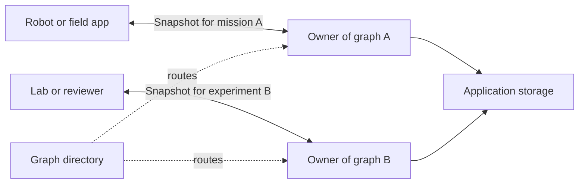

# Deployment size and hardware

A larger Zergraph application can run many independent graphs. Each graph holds a
limited set of data, such as one robot mission, site inspection, or experiment.
The application assigns graphs to workers, stores snapshots, and delivers updates.

## Hardware targets

Only native desktop CI and the Apple M3 benchmarks have run. The small-device ports
and cluster design below are proposals.

| Target | Starting point | Work remaining |
|---|---|---|
| ESP32-S3 with 8 MB PSRAM | Tens or hundreds of short IDs and small properties | Custom ESP-IDF toolchain, build, and device tests |
| Luckfox Pico Mini A with 64 MB RAM | Small Linux application | Match the board's binary interface and measure memory |
| Raspberry Pi Zero 2 W with 512 MB RAM | First practical device test | Build for the installed OS and run the application |
| Native Linux, macOS, or Windows process | Thousands of nodes and edges | CI covers all three; timings use Apple M3 |
| 1,000 workers with 100 graphs each | 100,000 independent graphs | Build and measure the surrounding cluster system |

## Small devices

ESP32-S3 with PSRAM is the smallest target considered here. The
[Espressif datasheet](https://documentation.espressif.com/esp32_s3_datasheet_en.pdf)
lists an 8 MB PSRAM variant. The [external-RAM guide](https://docs.espressif.com/projects/esp-idf/en/latest/esp32s3/api-guides/external-ram.html)
explains how the heap can use that memory.

Zergraph uses `std` collections, owned JSON, and random UUIDs.
[ESP-IDF Rust bindings](https://github.com/esp-rs/esp-idf-sys) support the
`xtensa-esp32s3-espidf` target through a custom toolchain that builds `std`.
The locked UUID dependency uses `getrandom` 0.4. Its
[platform documentation](https://github.com/rust-random/getrandom) lists the ESP-IDF
`esp_fill_random` backend and notes an early-boot entropy limit.
A port must check toolchain compatibility, randomness initialization, PSRAM allocation,
and peak stack and heap use. There is no ready-to-flash Zergraph build.

The [Luckfox Pico Mini A](https://www.luckfox.com/Luckfox-Pico-Mini-A) has a 1.2 GHz
32-bit Cortex-A7, 64 MB DDR2, and Linux. Its binary must match the installed system's
ABI, the binary interface used by compiled code. Rust's
[Arm Linux target guide](https://doc.rust-lang.org/rustc/platform-support/arm-linux.html)
lists GNU, musl, and uClibc targets. [Cross-compilation](https://rust-lang.github.io/rustup/cross-compilation.html)
also needs a matching linker and system libraries. The graph shares RAM with Linux
and the rest of the application.

The Raspberry Pi Zero 2 W is a more practical first test. Its RP3A0 combines a
1 GHz quad-core Cortex-A53 and 512 MB RAM. See the
[Raspberry Pi specifications](https://www.raspberrypi.com/documentation/computers/processors.html).
A matching ARM64 system image and [Rust target](https://doc.rust-lang.org/rustc/platform-support.html)
avoid the custom ESP-IDF toolchain and leave more memory for snapshot exchange.

## Memory during snapshot exchange

The measured graph with 1,024 nodes and 4,096 edges encodes to 1,619,049 bytes.
A separate process with 10,000 nodes and 40,000 edges reached 72.8 MiB peak RSS on
Apple M3. That includes the input-ID list and process overhead. See
[Performance](PERFORMANCE.md) for the method.

A receiver can hold the live graph, incoming bytes, a decoded snapshot, and outgoing
bytes at the same time. Snapshot creation copies state. Decoding allocates state,
and restore builds the incoming-edge index.

Memory grows with distinct entities and property names. Deleted records remain in
snapshots. Repeated writes replace a register's value, but deletion does not reclaim
its storage. Long IDs, large JSON values, and dense graphs need their own measurements.

## A cluster design example

This example uses chosen budgets, not measured cluster capacity:

- 1,000 workers, each with 100 active graphs.
- 1,024 nodes and 4,096 edges per graph, matching the primary benchmark.
- 64 MiB per graph for live state and temporary allocations during exchange.
- A 16 GiB worker with 8 GiB reserved for graphs. The 100 graph budgets total 6.25 GiB.
- One outgoing snapshot per graph per minute, with sends spread over the minute.

The totals are:

```text
1,000 workers × 100 graphs          = 100,000 graphs
100,000 graphs × 1,024 nodes        = 102,400,000 nodes
100,000 graphs × 4,096 edges        = 409,600,000 edges
100 × 1,619,049 bytes ÷ 60 seconds ≈ 2.70 MB/s outgoing per worker
1,000 workers × 2.70 MB/s           ≈ 2.70 GB/s aggregate outgoing
```

The 64 MiB budget needs workload testing. Each extra recipient adds another snapshot
send. Receiving updates also costs bandwidth and decoding and merge time. The worker
needs additional resources for retries, storage, transport, and application work.

Each graph remains a complete replica. The application routes it by graph ID and
limits recipients to those that need its full state. An edge's endpoints belong to
the same graph. References to another graph can use properties or local proxy nodes
with the remote graph and entity IDs. The application resolves those references.

Adding workers does not split or accelerate a single graph's merge. Cross-graph
queries and transactions need application or database support.



## Device testing

A supported device needs a build and tests on its actual OS and toolchain. The test
must cover merge, deletion, revival, snapshot encoding, and restart. Peak memory,
snapshot size, and query and merge latency must include the real application and
transport. Those measurements define the usable device limit.

The [integration guide](INTEGRATION.md) gives the storage and exchange steps.
The [semantics reference](SEMANTICS.md) defines the snapshot and merge rules.
