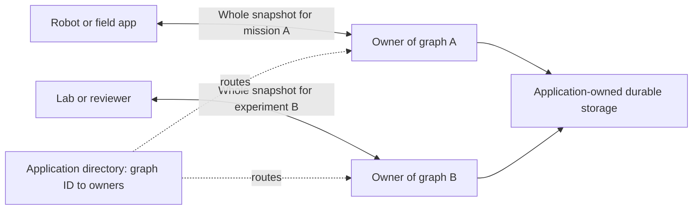

# From small devices to large deployments

Zergraph scales by keeping each graph a bounded working set and running as many independent graph owners as the application needs. A working set might be one inspection, robot mission, incident, project, tenant, or experiment. The library handles local graph state and merging; the surrounding system handles storage and delivery.

## A reasonable hardware envelope

| Level | Plausible target | Useful starting workload | Evidence |
|---|---|---|---|
| Smallest experimental device | ESP32-S3 with 8 MB PSRAM, using ESP-IDF and its Rust `std` toolchain | Tens or hundreds of compact identities and simple properties | Reasoned porting target; no build or hardware run |
| Smallest Linux experiment | Luckfox Pico Mini A class: Cortex-A7, 64 MB DDR2 | A deliberately small working set in a prebuilt application | Vendor specifications verified; binary/ABI and memory budget still need testing |
| Practical small computer | Raspberry Pi Zero 2 W: 512 MB RAM, quad-core Cortex-A53 | A bounded robot, sensor-gateway, or field-work graph | Plausible acceptance-test platform; not yet run on hardware |
| Laptop / server process | Native Linux, macOS, or Windows | Thousands of nodes and links, sized to the application | CI on all three; performance measurements on Apple M3 |
| Data-center application | An illustrative 1,000 workers, each owning 100 independent graphs | 100,000 small graphs; about 102 million aggregate nodes at the primary fixture's shape | Architecture and capacity model, not a cluster benchmark |

There is no measured maximum device or cluster size. The lower targets describe plausible ports; the upper example demonstrates how a small library can participate in a large system without making every peer hold one global graph.

## The small-device case

**ESP32-S3 with PSRAM is the smallest target worth exploring here.** Espressif's [ESP32-S3 datasheet](https://documentation.espressif.com/esp32_s3_datasheet_en.pdf) identifies an 8 MB PSRAM variant, and its [external-RAM guide](https://docs.espressif.com/projects/esp-idf/en/latest/esp32s3/api-guides/external-ram.html) explains how configured PSRAM can serve heap allocations. Start with a tiny observation graph and short IDs; keep images and other payloads elsewhere.

The current core uses `std` collections, owned JSON, and random UUID writers. [ESP-IDF Rust bindings](https://github.com/esp-rs/esp-idf-sys) support the `xtensa-esp32s3-espidf` route, which requires a custom toolchain and building `std`. The locked UUID dependency obtains randomness through `getrandom` 0.4; its [platform documentation](https://github.com/rust-random/getrandom) lists ESP-IDF's `esp_fill_random` backend and an early-boot entropy caveat. Toolchain compatibility, entropy initialization, PSRAM allocation, binary size, stack, and heap remain porting work. This is a reasoned target, not a ready-to-flash build.

For Linux, the [Luckfox Pico Mini A](https://www.luckfox.com/Luckfox-Pico-Mini-A) lists a single 1.2 GHz 32-bit Cortex-A7, 64 MB DDR2, and Linux. That makes a small prebuilt application plausible, provided its binary matches the board image. Rust's [Arm Linux target guide](https://doc.rust-lang.org/rustc/platform-support/arm-linux.html) distinguishes GNU, musl, and uClibc ABIs; [cross-compilation](https://rust-lang.github.io/rustup/cross-compilation.html) also needs a compatible linker and sysroot. Linux, networking, camera workloads, and graph exchange all share that RAM.

The more practical first Linux test is a **Raspberry Pi Zero 2 W**. Its RP3A0 combines a 1 GHz quad-core 64-bit Cortex-A53 and 512 MB RAM ([Raspberry Pi documentation](https://www.raspberrypi.com/documentation/computers/processors.html)). Use a matching ARM64 userspace and [Rust target](https://doc.rust-lang.org/rustc/platform-support.html), then run the actual application's graph and exchange cycle. This avoids the custom ESP-IDF path and gives much more memory margin.

## What is measured today

The primary fixture has **1,024 nodes, 4,096 edges**, two node properties, and one edge property. Its complete JSON snapshot is **1,619,049 bytes**. A separate **10,000-node / 40,000-edge** graph process on Apple M3 reported **72.8 MiB peak RSS**, including its input-ID list and process overhead. See [PERFORMANCE.md](PERFORMANCE.md) for timings and method.

Source size, wire size, live graph size, and process RSS are different quantities. Snapshot creation copies retained graph state; decoding allocates another state; restore builds the incoming index. A busy receiver may hold a live graph, incoming bytes, a decoded snapshot, and outgoing bytes at once. Memory grows with distinct entities and property names, including tombstones. Repeated writes replace existing register values; deletion does not reclaim them.

Use the measured fixture to plan an experiment, then measure the intended workload. Long strings, large JSON objects, dense/high-degree graphs, and sustained churn can cost much more.

## A plausible data-center composition

Consider the following **chosen design budgets**, rather than extrapolated capacity guarantees:

- 1,000 application workers across a cluster.
- 100 independent active graphs per worker.
- 1,024 nodes and 4,096 edges per graph, using the measured fixture shape.
- A chosen 64 MiB resident/transient budget per active graph: 6.25 GiB for 100 graphs, inside an 8 GiB graph budget on a 16 GiB worker.
- One complete outgoing snapshot per graph per minute on average, with delivery staggered by the application.

The arithmetic is transparent:

```text
1,000 workers × 100 graphs                 = 100,000 independent graphs
100,000 graphs × 1,024 nodes               = 102,400,000 aggregate nodes
100,000 graphs × 4,096 edges               = 409,600,000 aggregate edges
100 × 1,619,049 bytes ÷ 60 seconds         ≈ 2.70 MB/s outgoing per worker
1,000 workers × 2.70 MB/s                 ≈ 2.70 GB/s aggregate outgoing
```

That is a reasonable system-design starting point, not evidence that this cluster has been built. The 64 MiB allocation is an explicit budget to validate, not a live-memory measurement or a universal allowance. Fan-out multiplies outgoing traffic; bidirectional exchange adds ingress, decode/merge work, and reply traffic. Retry buffers, transport framing, encryption, storage, application work, and failure headroom require their own allowance.

Each graph remains an independent complete replica. The application routes a graph by tenant/site/mission ID, assigns workers, persists snapshots, and restricts recipients to those intended to hold its complete retained state. Represent remote references as properties or local proxy nodes containing remote graph/entity IDs; resolve them in the application. An edge's endpoints must belong to the same graph. Global traversals, cross-graph transactions, and query federation require application or database support. Adding workers does not make a single graph's full-state merge distributed or faster.

## A simple composition



Transport, graph identity/routing, durable replacement, authentication, and delivery scheduling sit outside the crate. A filtered subset of one graph is not a valid partial-replication protocol: preserve its complete state and tombstones during exchange. [INTEGRATION.md](INTEGRATION.md) covers the handoff boundary; [SEMANTICS.md](SEMANTICS.md) defines merge behavior.

## Turn a proposed target into a supported one

Build for its actual OS/toolchain, then run merge, deletion/revival, snapshot round-trip, and restart tests on the device. Record graph shape and retained state, peak memory during exchange, maximum snapshot bytes, and sustained query/decode/merge latency with the real transport and application present. A successful run establishes a useful device-specific envelope; the current laptop benchmark supplies the starting point.
